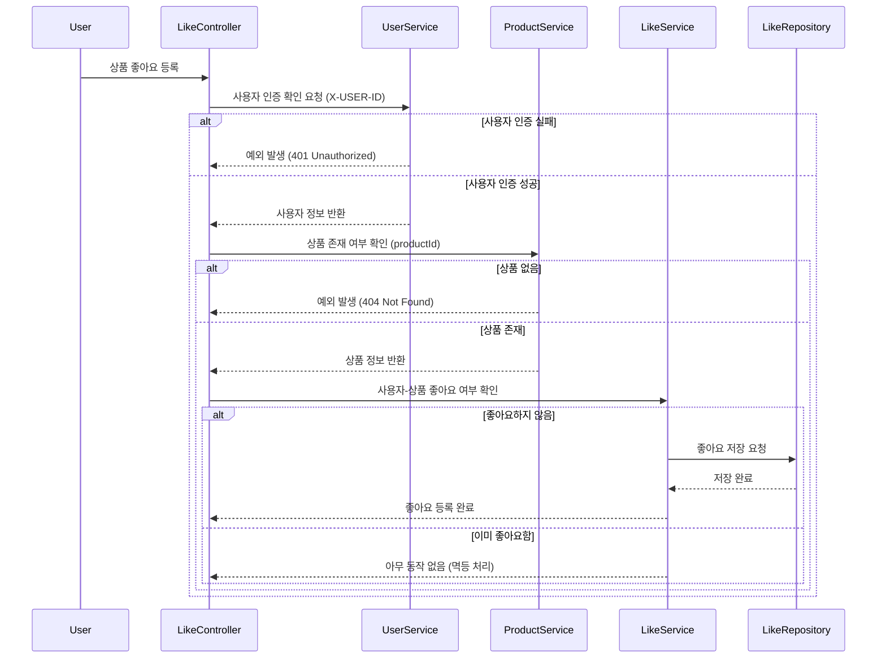
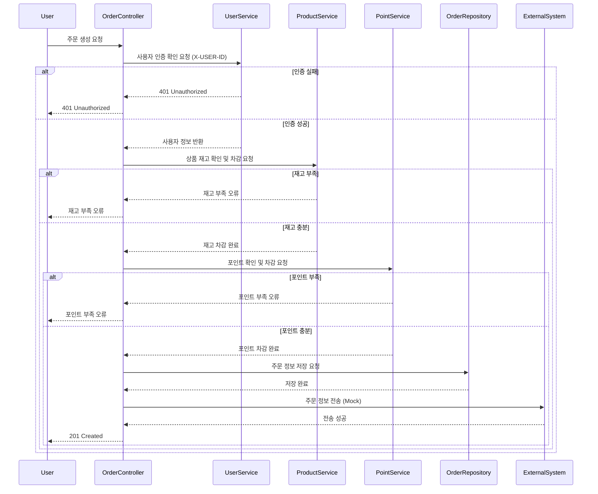

## 상품 좋아요 등록

```mermaid
sequenceDiagram
    participant User
    participant LikeController
    participant UserService
    participant ProductService
    participant LikeService
    participant LikeRepository

    User->>LikeController: 상품 좋아요 등록
    LikeController->>UserService: 사용자 인증 확인 요청 (X-USER-ID)
    alt 사용자 인증 실패
        UserService-->>LikeController: 예외 발생 (401 Unauthorized)
    else 사용자 인증 성공
        UserService-->>LikeController: 사용자 정보 반환
        LikeController->>ProductService: 상품 존재 여부 확인 (productId)
        alt 상품 없음
            ProductService-->>LikeController: 예외 발생 (404 Not Found)
        else 상품 존재
            ProductService-->>LikeController: 상품 정보 반환
            LikeController->>LikeService: 사용자-상품 좋아요 여부 확인
            alt 좋아요하지 않음
                LikeService->>LikeRepository: 좋아요 저장 요청
                LikeRepository-->>LikeService: 저장 완료
                LikeService-->>LikeController: 좋아요 등록 완료
            else 이미 좋아요함
                LikeService-->>LikeController: 아무 동작 없음 (멱등 처리)
            end
        end
    end
```

## 주문 생성 및 결제

```mermaid
sequenceDiagram
    participant User
    participant OrderController
    participant UserService
    participant ProductService
    participant PointService
    participant OrderRepository
    participant ExternalSystem

    User->>OrderController: 주문 생성 요청
    OrderController->>UserService: 사용자 인증 확인 요청 (X-USER-ID)
    alt 인증 실패
        UserService-->>OrderController: 401 Unauthorized
        OrderController-->>User: 401 Unauthorized
    else 인증 성공
        UserService-->>OrderController: 사용자 정보 반환

        OrderController->>ProductService: 상품 재고 확인 및 차감 요청
        alt 재고 부족
            ProductService-->>OrderController: 재고 부족 오류
            OrderController-->>User: 재고 부족 오류
        else 재고 충분
            ProductService-->>OrderController: 재고 차감 완료

            OrderController->>PointService: 포인트 확인 및 차감 요청
            alt 포인트 부족
                PointService-->>OrderController: 포인트 부족 오류
                OrderController-->>User: 포인트 부족 오류
            else 포인트 충분
                PointService-->>OrderController: 포인트 차감 완료

                OrderController->>OrderRepository: 주문 정보 저장 요청
                OrderRepository-->>OrderController: 저장 완료

                OrderController->>ExternalSystem: 주문 정보 전송 (Mock)
                ExternalSystem-->>OrderController: 전송 성공

                OrderController-->>User: 201 Created
            end
        end
    end
```
