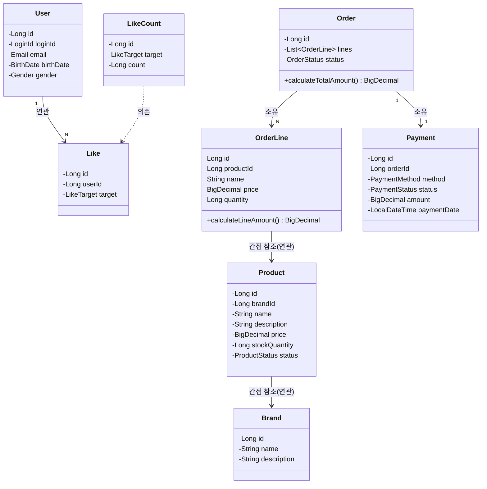

```mermaid
classDiagram
direction TB

    class Brand {
    -Long id
    -String name
    -String description
    }

    class Product {
	    -Long id
	    -Long brandId
	    -String name
	    -String description
	    -BigDecimal price
	    -Long stockQuantity
	    -ProductStatus status
    }

    class Like {
	    -Long id
	    -Long userId
	    -LikeTarget target
    }

    class LikeCount {
	    -Long id
	    -LikeTarget target
	    -Long count
    }

    class Order {
	    -Long id
      -List~OrderLine~ lines
      -OrderStatus status
      +calculateTotalAmount() BigDecimal
    }

    class OrderLine {
      Long id
      Long productId
      String name
      BigDecimal price
      Long quantity
      +calculateLineAmount() BigDecimal
    }

    class Payment {
        -Long id
        -Long orderId
        -PaymentMethod method
        -PaymentStatus status
        -BigDecimal amount
        -LocalDateTime paymentDate
    }

    class User {
	    -Long id
	    -LoginId loginId
	    -Email email
	    -BirthDate birthDate
	    -Gender gender
    }

    Product --> Brand : 간접 참조(연관)

    User "1" --> "N" Like : 연관
    LikeCount ..> Like : 의존

    Order "1" --> "N" OrderLine : 소유
    OrderLine --> Product : 간접 참조(연관)

    Order "1" --> "1" Payment : 소유
```

